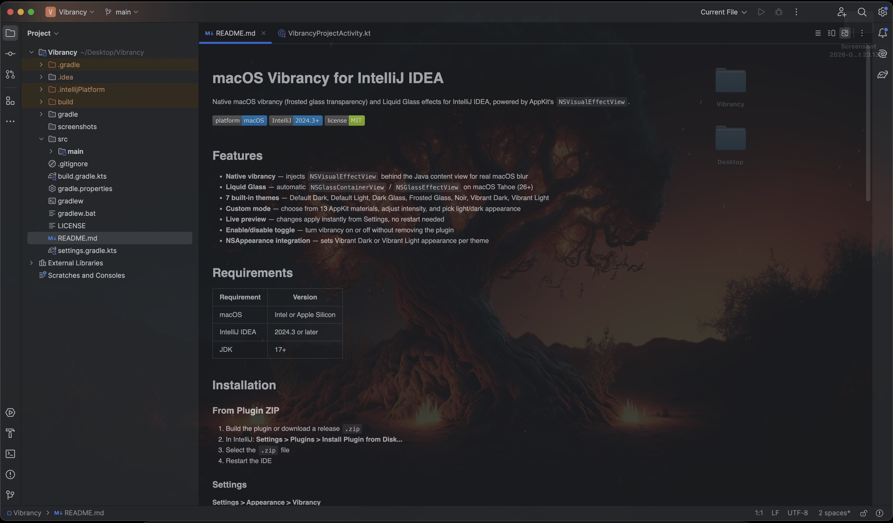
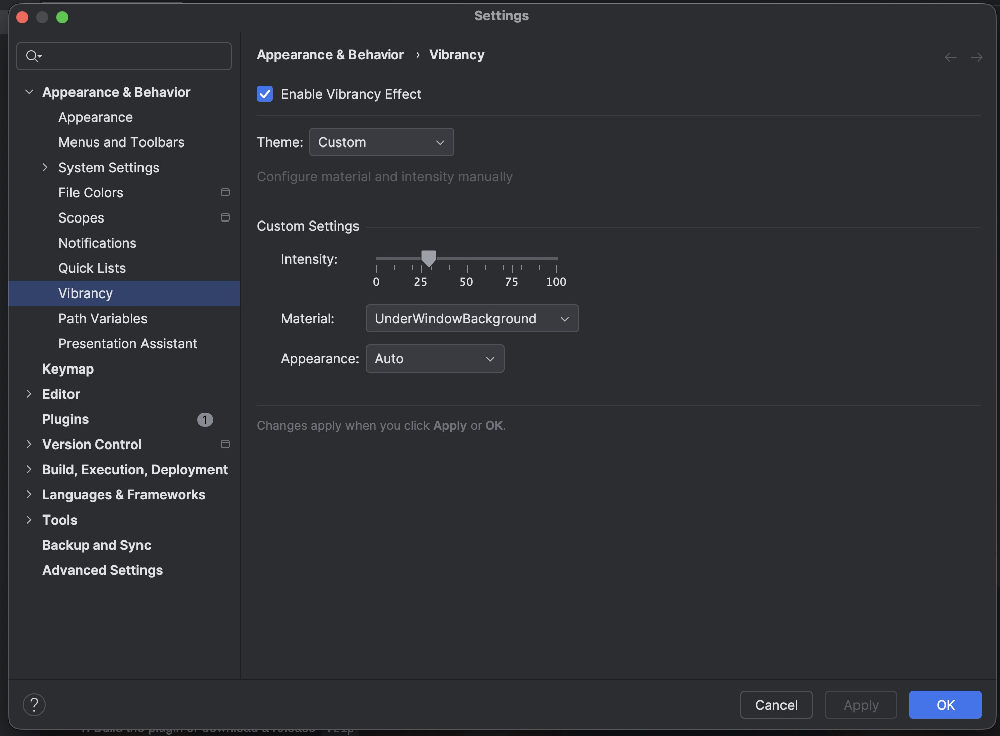

# macOS Vibrancy for IntelliJ IDEA

Native macOS vibrancy (frosted glass transparency) and Liquid Glass effects for IntelliJ IDEA, powered by AppKit's `NSVisualEffectView`.


<p align="center">
  
</p>

## Features

- **Native vibrancy** — injects `NSVisualEffectView` behind the Java content view for real macOS blur
- **Liquid Glass** — automatic `NSGlassContainerView` / `NSGlassEffectView` on macOS Tahoe (26+)
- **7 built-in themes** — Default Dark, Default Light, Dark Glass, Frosted Glass, Noir, Vibrant Dark, Vibrant Light
- **Custom mode** — choose from 13 AppKit materials, adjust intensity, and pick light/dark appearance
- **Live preview** — changes apply instantly from Settings, no restart needed
- **Enable/disable toggle** — turn vibrancy on or off without removing the plugin
- **NSAppearance integration** — sets Vibrant Dark or Vibrant Light appearance per theme

## Requirements

| Requirement | Version |
|---|---|
| macOS | Intel or Apple Silicon |
| IntelliJ IDEA | 2024.3 or later |
| JDK | 17+ |

## Installation

### From Plugin ZIP

1. Build the plugin or download a release `.zip`
2. In IntelliJ: **Settings > Plugins > Install Plugin from Disk...**
3. Select the `.zip` file
4. Restart the IDE

### Settings

**Settings > Appearance > Vibrancy**

## Theme Presets

| Theme | Material | Alpha | Appearance | Description |
|---|---|---|---|---|
| Default Dark | UnderWindowBackground | 0.88 | Vibrant Dark | Balanced dark frosted glass |
| Default Light | UnderWindowBackground | 0.90 | Vibrant Light | Light frosted glass for bright themes |
| Dark Glass | Sidebar | 0.82 | Vibrant Dark | Strong dark glass — more desktop visible |
| Frosted Glass | HUDWindow | 0.85 | Vibrant Dark | HUD-style deep frosted glass |
| Noir | Titlebar | 0.92 | Vibrant Dark | Minimal — subtle dark with slight transparency |
| Vibrant Dark | ContentBackground | 0.80 | Vibrant Dark | Maximum vibrancy — strong transparency |
| Vibrant Light | ContentBackground | 0.84 | Vibrant Light | Strong light vibrancy |
| Custom | User-defined | User-defined | User-defined | Full manual control over material, intensity, and appearance |

### Custom Mode

<p align="center">
  
</p>

When the **Custom** theme is selected, the following controls appear:

- **Intensity** — slider (0–100) controlling window alpha (mapped to 0.75–1.0)
- **Material** — one of 13 AppKit `NSVisualEffectMaterial` values:
  Titlebar, Selection, Menu, Popover, Sidebar, HeaderView, Sheet, WindowBackground, HUDWindow, FullScreenUI, ToolTip, ContentBackground, UnderWindowBackground
- **Appearance** — Auto, Vibrant Light, or Vibrant Dark

## Build from Source

### Prerequisites

- JDK 17+
- Git

### Steps

```bash
git clone <repo-url>
cd Vibrancy

# Build the distributable plugin ZIP
./gradlew buildPlugin
# Output: build/distributions/Vibrancy-1.0.0.zip

# Run a sandboxed IDE with the plugin loaded
./gradlew runIde
```

## Project Structure

```
src/main/kotlin/com/vibrancy/
├── MacVibrancyEffect.kt          # Core native vibrancy engine
│                                  #   NSVisualEffectView injection, Liquid Glass,
│                                  #   AWTWindow patching, live settings update
├── VibrancyTheme.kt              # Theme presets (material, alpha, appearance)
├── VibrancyProjectActivity.kt    # Startup hook — applies vibrancy on project open
└── settings/
    ├── VibrancySettings.kt       # Persisted settings via PersistentStateComponent
    └── VibrancyConfigurable.kt   # Settings UI (theme selector, custom controls)
```

## How It Works

1. **NSVisualEffectView injection** — an `NSVisualEffectView` is inserted into the window's `NSThemeFrame` as a sibling behind the Java `AWTView`, providing the blur material
2. **Transparent window** — `NSWindow` is set to non-opaque with a `clearColor` background so the blur shows through
3. **Window alpha** — `NSWindow.alphaValue` is set per theme to control overall transparency intensity
4. **Liquid Glass** — on macOS 26+, an `NSGlassContainerView` (or `NSGlassEffectView`) is added for the Liquid Glass effect
5. **AWTWindow patching** — a missing `windowWillReturnFieldEditor:toObject:` selector is added to `AWTWindow` via the ObjC runtime to prevent crashes when vibrancy triggers the delegate cascade
6. **Live updates** — the settings panel calls `updateSettings()` which modifies native view properties in-place without restarting

## Known Limitations

- **Opaque Java rendering** — Java's Metal/OpenGL renderer draws into opaque buffers, so the desktop blur from `NSVisualEffectView` is not visible through Swing-rendered content. The vibrancy effect is most visible at window edges and through any transparent UI areas.
- **Material changes** — switching material types on an existing `NSVisualEffectView` may occasionally require an IDE restart for full visual effect.

## License

MIT — see [LICENSE](LICENSE)
